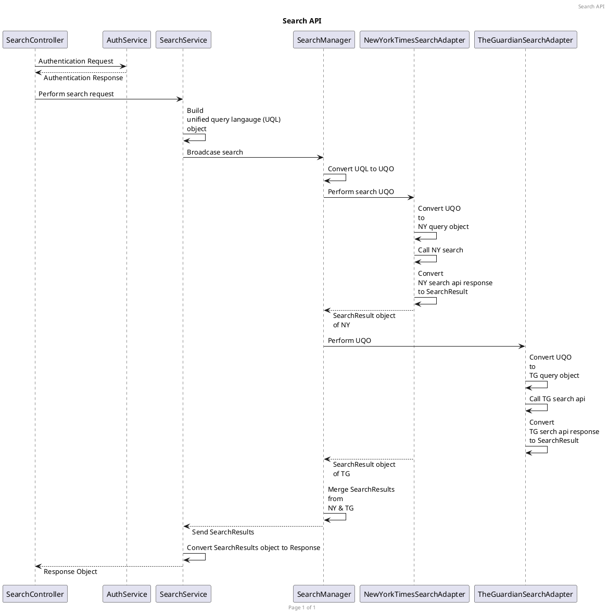

# Getting Started

### Design

**UQL** - A DSL, user input getting converted to UQL object. Interaction between _service layer_ & _business layer_. 
Abstracting business domain object for building search query. 

**UQO** - An object to interact between SearchManager and other search providers

### Creating REACT App
`npx create-react-app article-finder`  
`npm install react-bootstrap bootstrap@5.1.3`  
`add import 'bootstrap/dist/css/bootstrap.min.css' to index.js`  
`npm install axios`  

### Prerequisites:
1. Java 17
2. SpringBoot 2.6.4
3. SpringCloud 2021.0.1

### Documentation
1. Swagger[TODO]
2. JavaDoc

### NFR
1. Security - Using key to access API/Encryption
2. Logging
3. Exception Handling
4. Tracing
5. Circuit Breaker

### CI/CD
1. Jenkinsfile
2. Dockerfile
3. Test
4. Ready to deploy on different env

`
### Deployment
` docker create network --subnet=192.20.0.0/16 search-api-network`  
` docker run --rm -d --network=search-api-network --ip 192.20.0.2 -p 4040:4040 shanu040/search-api-config` < /br>
` docker run --rm -d --network=search-api-network -e ARTICLE-FINDER.STORE-LOCATION=/tmp/store -e SPRING.CONFIG.IMPORT=optional:configserver:http://192.20.0.2:4040/ -p 8080:8080 shanu040/search-api`

### Reference Documentation

For further reference, please consider the following sections:

* [Official Apache Maven documentation](https://maven.apache.org/guides/index.html)
* [Spring Boot Maven Plugin Reference Guide](https://docs.spring.io/spring-boot/docs/2.6.4/maven-plugin/reference/html/)
* [Create an OCI image](https://docs.spring.io/spring-boot/docs/2.6.4/maven-plugin/reference/html/#build-image)
* [Spring Web](https://docs.spring.io/spring-boot/docs/2.6.4/reference/htmlsingle/#boot-features-developing-web-applications)
* [Spring Boot DevTools](https://docs.spring.io/spring-boot/docs/2.6.4/reference/htmlsingle/#using-boot-devtools)

### Guides

The following guides illustrate how to use some features concretely:

* [Building a RESTful Web Service](https://spring.io/guides/gs/rest-service/)
* [Serving Web Content with Spring MVC](https://spring.io/guides/gs/serving-web-content/)
* [Building REST services with Spring](https://spring.io/guides/tutorials/bookmarks/)